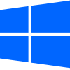

<p align="center">
  
</p>

<h1 align="center">Wobblin</h1>

<p align="center">
  <strong>Bring the legendary physics-based Wobbly & Burn Window animations to modern Windows desktop.</strong>
</p>

<p align="center">
  <a href="https://github.com/aziqi/Wobblin-Windows/releases">
    
  </a>
  <a href="https://github.com/aziqi/Wobblin-Windows/stargazers">
    
  </a>
  <a href="https://github.com/aziqi/Wobblin-Windows/blob/main/LICENSE">
    
  </a>
</p>

<p align="center">
  
  &nbsp;
  
  &nbsp;
  <strong>Supported OS:</strong> Windows 10 & 11 (64-bit)
</p>

---

## ✨ Highlights & Key Features

Wobblin is a lightweight, open-source desktop utility for Windows 10 & 11 that reintroduces fluid **Wobbly Windows** physics and **Burn/Fade** window animations powered by DirectX 11 hardware acceleration and a sleek Qt6 Fluent Dark UI.

* 🌀 **Kinetic Soft-Body Window Physics**: Dynamic spring-mass-damper mesh deformations during window dragging & movement.
* 🔥 **Custom Shader Window Animations**: Smooth GPU-accelerated Burn, Fade, and Scale effects on window Open, Close, and Minimize events.
* 🎨 **Modern Fluent Dark Interface**: Clean, frameless Qt6 desktop control panel with custom window titlebar, live exclusions list, and system tray integration.
* ⚙️ **Process Exclusion Rules**: Easily exclude specific software or games by process name (`.exe`) to prevent unwanted window hooking.
* ⚡ **High Efficiency**: Built natively in C++17 with Direct3D 11 hardware texture capturing and low-overhead Win32 hooks.

---

## 🛠️ Architecture & Tech Stack

| Component | Technology | Description |
| :--- | :--- | :--- |
| **Framework & UI** | Qt 6.8+ (C++17) | Modern frameless interface, system tray controls, and custom window management. |
| **Graphics Engine** | Direct3D 11 & DXGI | Hardware-accelerated mesh deformation and pixel shader effects. |
| **Hooking Mechanism** | Win32 API (`SetWinEventHook`, `SetWindowsHookEx`) | Low-level event processing for seamless OS-wide window tracking. |
| **Physics Model** | Spring-Mass-Damper Grid | Real-time 2D planar SoftBody mesh simulation. |

---

## 🚀 Building from Source

### Prerequisites
* **Windows 10 / 11** (64-bit)
* **Visual Studio 2022** (with C++ Desktop Workload & MSVC v143)
* **CMake** (v3.16 or higher)
* **Qt 6** (with `Core`, `Gui`, `Widgets`, `Svg`, `Network` components)

### Build Commands

```powershell
# 1. Clone the repository
git clone https://github.com/aziqi/Wobblin-Windows.git
cd Wobblin-Windows

# 2. Configure build environment with CMake
cmake -B build -S . -DCMAKE_BUILD_TYPE=Release

# 3. Compile Release binary
cmake --build build --config Release
```

The compiled output and deployed runtime dependencies will be generated in `build/Release/Wobblin.exe`.

---

## 🤝 Contributing & License

Contributions, issue reports, and feature suggestions are welcome! Distributed under the [MIT License](LICENSE).

<br>
<div align="center">
  <small>
    <b>Keywords:</b> wobbly windows, jelly windows, windows 10, windows 11, desktop customization, desktop ricing, window physics, desktop effects, fluid window animations, compiz fusion alternative, kwin wobbly windows, c++ window manager, qt6 desktop application, directx 11 rendering, dwm hooking.
  </small>
</div>
